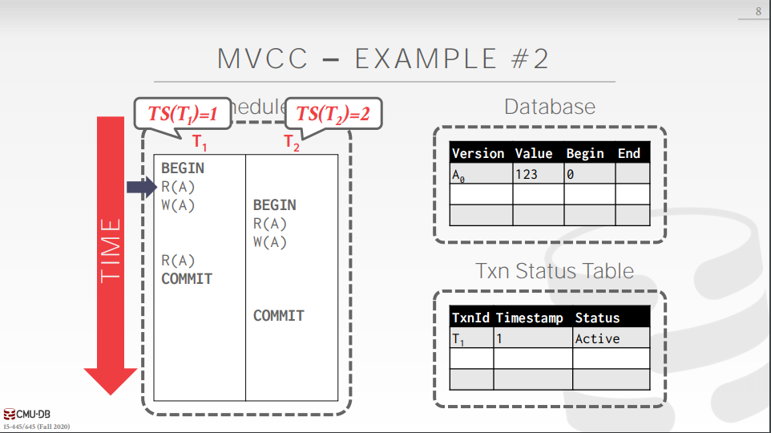

# 并发控制——MVCC入门

## 并发控制回顾

并发控制是为了保证事务的一致性和隔离性，防止多个事务对同一个对象进行访问而造成数据库系统进入不一致状态。

常用的并发控制协议

* 基于锁的协议：`2PL(two phase locking)`，`strict 2PL`, `rigious 2PL`。由于使用`2PL`是基于这样一种假设：数据库中会频繁地发生冲突，即多个事务会对同一个对象(`tuple`)同时进行访问，这是一种悲观的思想，所以我们称之为悲观并发控制。通过基于锁的协议，我们可以很容易得实现`可串行化调度`，但是由于频繁地获取锁和释放锁开销特别昂贵，会导致数据库性能下降得很严重，并且事实证明，数据库中多个事务同时对一个对象同时访问的频率很低，所以为了减少开销，出现了一些其它的并发控制协议。
* 基于时间戳的协议：`TS(timestamp ordering)`，TS具有**递增**的性质，每当事务进入数据库系统时，系统会为它分配一个时间戳`TS`，同时读写数据项，回味数据项分配读时间戳`R-timestamp`和写时间戳`W-timestamp`，只有TS都大于它们时，才能成功执行操作，否则需要中止事务。
* 基于验证的协议: 也成为乐观并发控制协议(OCC)，这是一种具体的方法，需要和乐观并发控制思想区别，它在基于时间戳的协议上做了改进，事务进入系统时并不会分配时间戳，而是在验证阶段为它分配一个时间戳。
* 多版本并发控制协议(MVCC): 在之前的并发控制协议中，事务所有的写操作都是`in-place modification`，在原本的tuple上进行修改。然而，在MVCC中，(1) 所有的写操作不会对数据项原地修改，而是创建一个新的版本，为什么不说拷贝呢，因为拷贝意味着复制一份与原来一模一样的对象，而新的版本意味着数据项的值与原来不同。(2) 当执行读操作时，系统会`根据事务的隔离级别选择一个对事务来说的可见版本返回给事务`。

## MVCC

DBMS会维护一个**逻辑**对象的多个**物理**版本。

* 当事务对一个数据项执行写操作时，DBMS会创建这个数据项的一个新版本。
* 当事务对一个数据项执行读操作时，它会读到在它开始时已存的最新版本的数据项。

### MVCC的优势是什么？

* 读操作不会阻塞写操作，写操作不会阻塞读操作
* 支持跨时间(`time-travel`)查询

下面逐一解释：

1. 读操作不会阻塞写操作，写操作不会阻塞读操作。回想其它的并发控制协议，`2PL`中，共享锁和排他锁是不兼容的，所以必然会阻塞；而基于时间戳的协议或者OCC中，事务读操作可能会被阻塞，因为另一个事务可能已经把它想要读取的数据项给覆盖了，这时候它只能阻塞等待，直到另一个事务中止回滚才能读到自己想要的数据。而在MVCC中，对于写操作，它只是创建一个新版本，这样无论如何事务永远能读取到它想要到数据，并且不会被覆盖。
2. 支持跨时间查询。MVCC保存了每一数据项的所有版本，这样能满足一些金融公司的业务需求，比如计算几年前的某一个账务的总金额是多少。

### Example

现在有两个事务需要访问数据库，它们的调度顺序如下图。从High Level的角度，DBMS会维护两张表，右上角的表用来记录数据项的每个版本信息，版本号`Version`，版本的值`Value`，写操作时事务开始的时间戳`Begin`，事务结束的时间戳`End`。右下角的表用来判断系统中哪些版本对于事务来说是可见的，这取决于不同的隔离级别。

事务T1执行完读操作后，接着对A执行了写操作。此时会为A创建一个新的版本A1，开始的时间戳即为T1的时间戳`1`，然后结束的时间戳设置为`inf`，并把旧版本的结束时间戳设置为新版本开始的时间戳`1`。

这时候调度器选择了T2，T2运行，首先执行读取A，T2时间戳为`2`，而最A的最新版本为A1，并且也在A1的开始和结束区间内。但是T2仍然读不到这个版本，假设DBMS此时事务隔离级别为读提交(RC)或更强，我们查看事务状态表，版本A1的开始时间戳为1，并且表中T1的时间戳为1，但是T1还没有提交。说明版本A1对于T2来说是不可见的，所以T2只能读取A0。

紧接着，T2执行对A执行写操作，这时候T2必须停顿等待直到T1提交，这里发生了`write write conflict`，因为MVCC只保证了读操作不会影响写操作，写操作不会影响读操作，并没有保证事务对同一个数据项的写操作不会发生竞态条件，而MVCC一般是配合其它并发控制协议来使用的，假设这里是MVCC + 2PL，那么T2获取A上的排他锁失败，阻塞。

等到T1提交后，T2拿到了A上的排他锁，执行写操作，创建新版本，同时更新旧版本的时间戳。

## MVCC设计选择

设计MVCC，我们需要考虑下面几个因素：

* 并发控制协议
* 版本存储
* 垃圾回收
* 索引管理
* 删除

下面逐一介绍。

## 并发控制协议

1. MVCC + 时间戳

* 为事务分配时间戳`TS`来决定串行顺序。

2. MVCC + OCC

* 使用私有空间来创建新版本
* 三阶段协议

3. MVCC + 2PL

* 在读写A之前，先获取某个版本的共享锁/排他锁

## 版本存储

接下来要考虑的是如何在内存或者磁盘上存储版本。

对于每一个逻辑元组，DBMS会使用元组指针创建一个**版本链`version chain`**，其实就是一个单链表。

* 这样对链表进行遍历，就可以找到哪些版本对于事务是可见的
* 索引通常会指向链表头结点

大体都有三种方法来存储版本。

1. **追加存储**：新版本会被追加到同一个表的第一个空闲位置，然后把上一个版本的next指针指向当前版本。

2. **time-travel存储**：会新建一个辅助表，称为`time-travel table`，每次写操作时，拷贝一份当前版本到`time-travel table`中的空的slot，更新版本指针，next指针上一个旧版本指针，然后在原来表中，将要写入的数据覆盖原来的数据，版本号加一。

3. **delta 存储**:也会新建一个辅助存储空间，称为`delta storage segment`，但是与`time-travel存储`不同的是，它不会拷贝整个tuple，而是创建一个新的`Record`，这个`Record`只记录那些被修改过的字段，然后覆盖主表上的数据。毫无疑问，这样子性能是最好的。
e.g 考虑一下我们每个元组有1000个字段，当我只修改了一个字段时，我不需要拷贝整个1000个字段的元组到存储空间，只需要拷贝一个字段，这样子极大减少了开销。

追加存储中还会涉及两种版本链的顺序。

1. 旧-->新(O2N)

* 将新版本添加到链表尾部。
* 每次查找必须遍历整个链表。

2. 新-->旧(N2O)

* 对每个新版本，每次必须更新索引指针。(索引指向链表头结点，当有很多二级索引的时候，会更新大量的索引指针，导致效率很差)
* 查找不需要遍历整个链表。

## 垃圾回收

对于任意一个事务来说，存储那些永远不可见的旧版本数据毫无任何意义，DBMS需要及时清理它们防止数据膨胀。

如果版本符合下面条件之一，我们说它是`可回收的`或者`过期的`。
* 任何一个`active`的事务都看不见的版本。
* 由中止事务创建的版本。

### 垃圾回收需要考虑的两个因素(决策)
* 如何找到过期的版本
* 如何确定什么时候可以`放心地、安全地`回收过期的版本

### 方法一：元组级别的垃圾回收
在元组级别的垃圾回收中，我们可以选择两种方式：1. 后台垃圾回收器 2. 合作清理

1. 后台垃圾回收器：DBMS会在单独开启一个后台线程，定期地被唤醒进行全表扫描查找那些可回收的版本。这种方法
适用于任何一种版本存储。

2. 合作清理：在worker线程遍历版本链的同时辨别那些可回收的版本便进行清理。这种方式只适用于O2N的版本链顺序，
因为当线程遍历到一个对自己可见的版本时就会立刻返回了，这样子永远都不可能遍历到那些过期的版本。这样子就只能依赖
后台垃圾回收器来进行垃圾回收。
tips：清理完旧版本之后，需要把版本链头指针指向剩余的最旧的版本。

