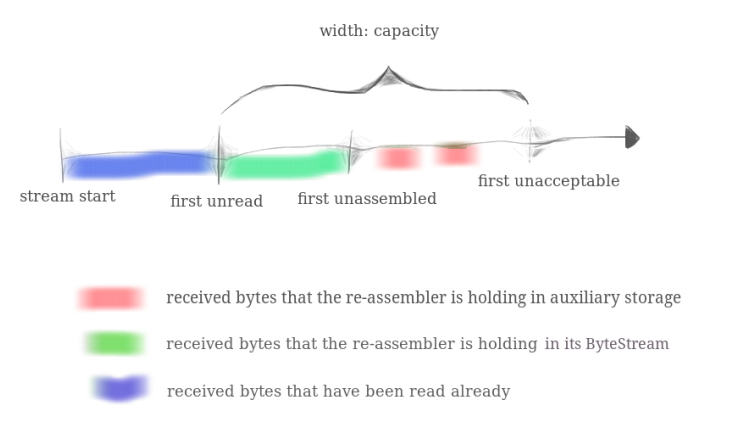

这个lab是要求我们完成一个分组重组器

在上一个Lab中，我们实现了一个内存中的字节流，这个Lab中，我们会实现一个分组重组器，将到来的无序、重复的字符
串重组为一个完整的字符串。<!--more-->

## Overview

在Lab0中，我们使用了``流套接字``来从一个网站获取信息或者是发送一个电子邮件，这是LInux内置的TCP协议实现的。
尽管网络层只提供``尽力而为``的服务来传输数据报，但TCP实现成功产生了一对可靠的、按序的字节流，一对是指一个
从自己的主机到服务器，另一个则是相反的方向。``尽力而为``的意思是无法处理在网络上的分组出现几种情况：`丢失`
，`乱序`, `被修改`, `重复`。


这是我们所要实现TCP的各个模块以及数据流。TCP的工作就是在不可靠的数据报网络上传递一对字节流（每个方向一个）。
这样写入连接一侧套接字的字节就会出现在对等点读取的字节流中，例如应用程序向socket中写入了数据，socket中的`
TCPSender`就会帮助你发送这些数据。反之亦然。Lab1中，我们会实现``StreamReassembler``，在Lab2、Lab3和Lab
4中，我们依次实现``TCPReceiver``, `TCPSender`和``TCPConnection``，然会将它们组合起来。  

## Putting substrings in sequence

在这个Lab和下一个Lab，我们会实现一个TCP Receiver：接收数据报并将其转换为一个可靠的字节流的模块，字节流会被
应用程序的套接字读取。就像我们在webget程序中从web server读取字节流一样。  

TCP Sender会将自己内存中的字节流分成一个个短的数据段(`segment`, 每片大小不会超过1460字节)，以便他们能装入
每一个数据报中。但是网络层可能会将这些数据报重新排序、在网络中丢弃或者重复发送。TCP Receiver必须将这些数据
段重新组装成它们开始时的连续字节流。  

在这个Lab中，我们将编写负责重新组装的数据结构：`StreamReassembler`。它会接受子串，每个子串由字节串，以及第
一个字节在完整字节流中的索引构成。（可能有点绕，后面会解释）流中的每个字节都有唯一的索引，从0开始向上计算。
`StreamReassemebler`会维护一个我们在lab0中已经实现的`ByteStream`对象作为输出：一旦重组器知道了流的下一个字
节，他就会将它写入到`ByteSteam`对象中。  

接口原型如下：

```c++
// Construct a `StreamReassembler` that will store up to `capacity` bytes.
StreamReassembler(const size_t capacity);

// Receive a substring and write any newly contiguous bytes into the stream,
// while staying within the memory limits of the `capacity`. Bytes that would
// exceed the capacity are silently discarded.
//
// `data`: the substring
// `index` indicates the index (place in sequence) of the first byte in `data`
// `eof`: the last byte of this substring will be the last byte in the entire stream
void push_substring(const string &data, const uint64_t index, const bool eof);
// Access the reassembled ByteStream (your code from Lab 0)
ByteStream &stream_out();
// The number of bytes in the substrings stored but not yet reassembled
size_t unassembled_bytes() const;
// Is the internal state empty (other than the output stream)?
bool empty() const;
```

## What’s the “capacity”?

`push_substring`函数会忽视任何会导致``StreamReassembler``超过其`capacity`的串部分，`capacity`限制了内存的使用，防止使用过多的内存。`capacity`是以下两者的上界：  

1、`ByteStream`对象中已经重组的字节数。下图中的绿色部分，以及：  

2、未组装子串可以使用的最大字节数。



把这张图弄懂，这个Lab实现起来就会轻松许多。  

蓝色代表已经pushed但是被read的字节，我们知道如果被read了，那么这些字节就已经从`ByteStream`对象中移除了。  

绿色代表存放在`ByteStream`对象中的字节。  

红色代表`StreamReassembler`中未重组的字节，存放在类中的一个辅助存储数据结构。

## FAQs

- 整个流的第一个字节的索引是什么？0  
- 实现需要考虑效率吗？请不要构建一个时间或空间效率极其低下的数据结构。Lab的期望是每个测试可以在不到0.5s内完成
- 不一致的子字符串应该如何处理?你可以假设它们不存在。也就是说，您可以假设有一个唯一的底层字节流，并且所有的子字符串都是它的(准确的)片  
- 应该使用什么？你可以使用任何觉得有用的标准库部分。特别的，我们希望你至少使用一种数据结构。  
- 字节应该什么时候写入到流中？越快越好。一个字节不应该出现在流中唯一的情况是，在它之前还有一个字节还没有被"pushed"
- 提供给`push substring()`函数的子字符串是否有重叠?是的。
- 需要在类中添加私有成员吗？需要。子串可以按任何顺序到达，所以你的数据结构不得不记住它们直到它们准备好放入流中——这意味着，它们之前所有的索引都已经被写入。
- 重组器可以存储重叠子串吗？不可以，实现一个接口正确的重组器存储重叠子串是可行的，但是这样做会破坏`capacity`作为内存限制的概念。

## Implementation

由于每个子串可以按任何顺序到达，所以要把每个子串保存下来，在必要的时候写进`ByteStream`对象中，首先定义一个结构体来将到来的子串结合成一个有机的整体：

```c++
struct Node {
    const std::string _data;
    const uint64_t _index;
    const bool _eof;  //这个成员不是一个很好的选择，因为整个流如果没有重叠、重发，那么最终只有一个子串会携带eof，每个子串都存储一个eof浪费了空间。
    Node(const std::string &data, const uint64_t index, const bool eof):
    _data(data),
    _index(index),
    _eof(eof) {}
    bool operator < (const Node &a) const {
        if (_index == a._index)
            return a._data.size() < _data.size();
        return _index < a._index;
    }
};
```

其次，我们应该用怎样的数据结构来保存这些子串？这个数据结构应该满足下列的特点：

1、最好是能**自动对index排序**。比如来了两个子串，先到来的一个是 Node1{data: "cd", index: 2, eof: false}，后到来的一个是 Node2{data: "b", index: 1, eof: false}。
那么后一个到来的子串在数据结构里面的存储应该在前一个到来的子串之前, 也就arr[0] = Node2, arr[1] = Node1，arr并不是数组，代表容器。

2、同时还能去重。如果两个子串index相同，并且子串的长度也相同，证明这两个子串是完全一样的，只需存储一个。

3、时间复杂度要低，最好插入和查找都是O(1)，次之也必须要低于O(n)。  

几种选择：set、单调队列、优先队列？

我选择的是set，因为set天然就带有这上述三种特点。  

### 添加成员变量

```c++
  private:
    // Your code here -- add private members as necessary.
    struct Node {
      const std::string _data;
      const uint64_t _index;
      const bool _eof; 
      Node(const std::string &data, const uint64_t index, const bool eof):
        _data(data),
        _index(index),
        _eof(eof) {}
      bool operator < (const Node &a) const {
          if (_index == a._index)
              return a._data.size() < _data.size();
          return _index < a._index;
      }
   };

    std::set<Node> set;
    // size_t next_index;
    ByteStream _output;  //!< The reassembled in-order byte stream
    size_t _capacity;    //!< The maximum number of bytes
```

### 实现push_substring接口

不管在lab1还是lab2，都要考虑许多corner case，而讲义中都没有一个很好的指导，需要自己去对着测试用例来感受如何设计，下面我给出一个较为合理的设计。

1、下一个应该写入`BytesStream`对象的子串首字节的索引 = `ByteStream`对象已经写入的字节数。你可以通过bytes_written()函数拿到。

2、如果到来的子串是是空串

​	2.1、如果携带了`eof`标志，那么说明已经流到达了最后一个字节，不再向`ByteStream`对象写入字节，需要调用`end_input()`。  

​	2.2、如果没有携带`eof`标志，那什么也不用做，因为空的子串不造成任何影响。  

3、到来的子串每个字节如果已经被接收，就忽略。我们只关注下一个需要接受的字节，需要对每个字节的索引和下一个应该写入`ByteStream`对象的子串首字节索引进行比较。  

4、如果到来的子串**有可能被重组**，那我们就把他保存到set中，并进行合并(如果存在可以合并的子串)。

5、合并后，如果已经存在了可以拼接的子串，根据偏移量进行位置的计算，进行拼接。

6、如果子串携带了`eof`标志，则应该调用`end_input()`

```c++
//! \details This function accepts a substring (aka a segment) of bytes,
//! possibly out-of-order, from the logical stream, and assembles any newly
//! contiguous substrings and writes them into the output stream in order.
void StreamReassembler::push_substring(const string &data, const size_t index, const bool eof) {
  size_t next_idx = _output.bytes_written();
  // if (_output.buffer_size() == _capacity) {
  //   // 不能用next_idx == capacity来判断。
  //   return;
  // }
  if (data.empty()) {
    if (eof) {
      _output.end_input();
      return;
    }
    return;
  }

  // choose whether the segment to be abandoned or left
  // e.g. byte_stream = "abc", data = "bcdef". we should keep the segment left
  if ( static_cast<int>(index + data.size() - 1) < static_cast<int>(next_idx))
    return;
  set.insert(Node(data, index, eof));
  // merge the segment as more as possible
  auto it = set.begin();
  while (it != set.end() && set.size() >= 2) {
    auto next_it = it;
    ++next_it;
    // must check iterator valid
    if (next_it == set.end()) {
      break;
    }
    size_t cur_lo = it->_index;
    size_t cur_hi = it->_data.empty() ? cur_lo : cur_lo + it->_data.size() - 1;
    size_t next_lo = next_it->_index;
    size_t next_hi = next_it->_data.empty() ? next_lo : next_lo + next_it->_data.size() - 1;
    // case 1: no overlap at the begin but maybe overlap on the end
    // e.g ["bc", "de", "efgh", "fg"]
    if (cur_hi < next_lo) {
      ++it;
      continue;
    }
    if (cur_hi >= next_hi) {
      //case 2: totally overlap
      // e.g ["bcde", "b", "c"]
     set.erase(next_it); 
    } else {
      assert(cur_hi >= next_lo && cur_hi <= next_hi);
      // we can't modify the set in-place, because if we do, the set can not protect the order.
      // so the begin() of set will return a const iterator.
      // construct new merge node
      string tmp = it->_data;
      size_t pos = tmp.size() - (next_it->_index - it->_index);
      assert(pos >= 0 && pos <= next_it->_data.size() - 1);
      tmp.append(next_it->_data.substr(pos));
      Node node(tmp, it->_index, it->_eof | next_it->_eof);
      // remove the obsolete node and insert the new merge node
      it = set.erase(it);
      it = set.erase(it);
      set.insert(node);
      it = set.begin();
    }
  }
```

### 实现unassembled_bytes
我们只需要考虑set中第一个子串是否包含下一个想要接受的字符就好了。
```c++
size_t StreamReassembler::unassembled_bytes() const {
  if (set.empty()) return 0;
  size_t rc = 0;
  size_t next_idx = _output.bytes_written();
  auto it = set.begin();
  if (it->_index <= next_idx)
    rc += it->_data.size() - (next_idx - it->_index);
  else
    rc += it->_data.size();
  for (++it; it != set.end(); ++it)
    rc += it->_data.size();
  return rc;
}
```

