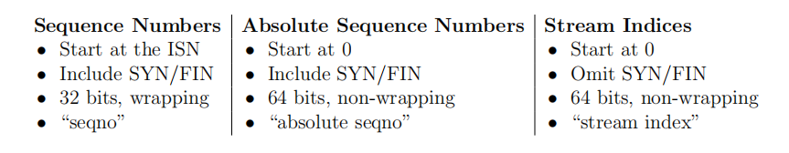
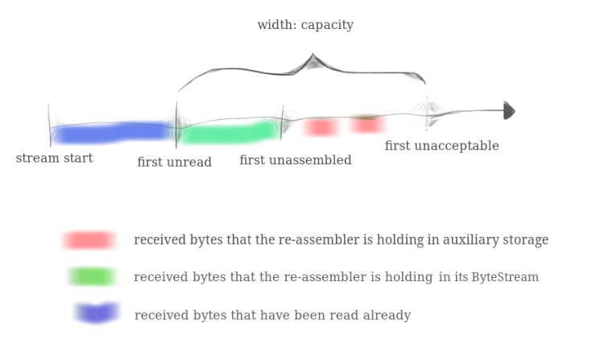

# Lab 2: The TCP Receiver

在这个lab中，我们需要实现一个TCP Receiver。

## 1 Translating between 64-bit indexes and 32-bit seqnos

作为热身，我们需要实现一个TCP表示索引的方式。在TCP头部中，空间是是什么珍贵的，每个字节的索引在流中不是一个64位数，而是一个32位数，被称为"sequence number", 或者"seqno"。由于我们的字节最终会进入到内存中的字节流进行处理，所以我们需要一个工具类，来对32位和64位索引进行相互转换。难点在**seqno** 和 **absolute seqno**的相互转换。三种索引的关系图如下：




### Implementation
`wrap`函数的实现较为简单，由于seqno中两个数的偏移量与abs seqno中对应两个数的偏移量相同，我们能得到一个等式:  
`seqno(x) - seqno(SYN) = abs_seqno(x) - abs_seqno(SYN)`  
而`abs_seqno(SYN) = 0`, `seqno(SYN) = isn`所以我们可以化简一下，得到我们想要求的序列号:   
`seqno(x) = abs_seqno(x) + isn` 
```c++
WrappingInt32 wrap(uint64_t n, WrappingInt32 isn) {
    return WrappingInt32{(static_cast<uint32_t>(n) + isn.raw_value())};
}
```

对于`unwrap`函数，我们需要稍微转换下思路，动下脑子。由于序列号为15，可能会存在多个绝对序列号，例如5、2^32 + 5、 2^33 + 5 ...等等。
我们需要用一个检查点来判断到底是那么多中的哪一个，函数的参数也为我们提供检查点`checkpoint`。考虑一下如果我们能求出离
`checkpoint`左右两边最近的两个可能解，那么就可以根据几何距离求出真正的那个解。具体来说，我们需要找到`checkpoint`
的左右两个解，`left_bound`和`right_bound`，它们之间的几何关系可以用数轴或者区间表示表示：[`left_bound`, `checkpoint`]、
[`checkpoint`, `right_bound`]，这样就可以根据`left_bound`和`right_bound`的离`checkpoint`的距离来得出真正
的解。**注意**，一个特例是，上述区间并不完全成立，在`checkpoint`为0时时，`left_bound`和`right_bound`应该为
同一个值，或者说解就是`right_bound`。
```c++
uint64_t unwrap(WrappingInt32 n, WrappingInt32 isn, uint64_t checkpoint) {
    // round down to multiple of (1ul << 32)
    uint64_t right_bound = checkpoint & 0xffffffff00000000;
    int64_t rel_offset = n - isn;

    right_bound += rel_offset < 0 ? rel_offset + (1ul << 32) : rel_offset;
    
    if (right_bound < checkpoint)
        right_bound += (1ul << 32);

    uint64_t left_bound = right_bound >= (1ul << 32) ? right_bound - (1ul << 32) : right_bound;
    // cout << "left_bound: " << left_bound << " check_point: " << checkpoint << " right_bound: " << right_bound << endl;
    return (checkpoint - left_bound) <= (right_bound - checkpoint) ? left_bound : right_bound;
}
```
还有一个需要注意的点是，我们得直接从`checkpoint`附近开始找可行解，而不是从0开始一直加2^32逼近`checkpoint`，
因为`checkpoint`有可能是一个非常大的数，例如0xfffffffeffffffff，这样实现有一个test会一直卡住，因为太慢了。  

测试结果如下：
```bash
 ctest -R wrap
Test project /home/linux/codespace/sponge/build
    Start 1: t_wrapping_ints_cmp
1/4 Test #1: t_wrapping_ints_cmp ..............   Passed    0.00 sec
    Start 2: t_wrapping_ints_unwrap
2/4 Test #2: t_wrapping_ints_unwrap ...........   Passed    0.00 sec
    Start 3: t_wrapping_ints_wrap
3/4 Test #3: t_wrapping_ints_wrap .............   Passed    0.00 sec
    Start 4: t_wrapping_ints_roundtrip
4/4 Test #4: t_wrapping_ints_roundtrip ........   Passed    0.14 sec

100% tests passed, 0 tests failed out of 4

Total Test time (real) =   0.16 sec
```
## 2 Implementing the TCP receiver
我们将要实现的`TCPReceiver`主要负责三件事。  
1. 从对等方接收Segment
2. 使用我们的之前实现的流重组器`StreamReassembler`重组Segment中的子串。
3. 计算确认号`ackno`和接收窗口大小`window size`，随后它们会被封装成一个Segment
发送给对等方。

看下我们需要实现的接口。
```c++
// Construct a `TCPReceiver` that will store up to `capacity` bytes
TCPReceiver(const size_t capacity); // implemented for you in .hh file

// Handle an inbound TCP segment
void segment_received(const TCPSegment &seg);

// The ackno that should be sent to the peer
//
// returns empty if no SYN has been received
//
// This is the beginning of the receiver's window, or in other words,
// the sequence number of the first byte in the stream
// that the receiver hasn't received.
std::optional<WrappingInt32> ackno() const;

// The window size that should be sent to the peer
//
// Formally: this is the size of the window of acceptable indices
// that the receiver is willing to accept. It's the distance between
// the ``first unassembled'' and the ``first unacceptable'' index.
//
// In other words: it's the capacity minus the number of bytes that the
// TCPReceiver is holding in the byte stream.
size_t window_size() const;

// number of bytes stored but not yet reassembled
size_t unassembled_bytes() const; // implemented for you in .hh file

// Access the reassembled byte stream
ByteStream &stream_out(); // implemented for you in .hh file
```
还有一个需要注意的点是`syn`和`fin`也会占用一个序列号，所以`length_in_sequence_space()`实现如下：
```c++
size_t TCPSegment::length_in_sequence_space() const {
    return payload().str().size() + (header().syn ? 1 : 0) + (header().fin ? 1 : 0);
}
```
我们后面会频繁用到这个函数。  

### 2.1 segment received()
每当一个新的segment到来时，这个函数就会被调用。  
这个函数的需要做到：  
* **如若需要，设置初始化序列号(isn)**。 第一个到达并且**SYN标志位被置位**报文段的序列号就是`初始化序列号`。
可能需要保存在内存中追踪它，因为后续计算绝对序列号以及生成相对序列号都需要用到它。同时需要注意携带`SYN`的segment也有
可能同样携带`FIN`。
* **将任何数据和流结束标记push到流重组器中**。`FIN`被置位说明payload中的最后一个字节是整个字节流中的最后一个字节。

给出算法设计思路：  
1. 第一个接收到的Segment必须是`SYN`置位的，记录isn，syn接收标志，更新ackno，同时有payload不为空的话就
push到流重组器中，如果携带`fin`也不要忘了end stream.
2. 对于不是`SYN`置位的Segment，我们需要计算出它的绝对序列号，将payload push到流重组器中，如果绝对序列号不合法
直接返回，因为我们能断言非`SYN`置位的Segment的绝对序列号必然是大于0的。同时我们还要注意绝对序列号计算中检查点的计算。lab指导书上说了这么一句话
`In your TCP implementation, you’ll use the index of the last reassembled byte as the checkpoint`，
而在字节流中已经重组的最后一个字节的索引可以通过`bytes_written() - 1`表达式得到，但需要注意的是`bytes_written`
不能为0, 否则会产生溢出。
3. 在更新`ackno`时，可以考虑下一个感兴趣的字节是流重组器第一个没有重组的字节，它的索引为`bytes_written()`，同样
需要注意，而绝对序列号就是`bytes_written() + 1`，这是一个invariant：ackno = `bytes_written() + 1`。同时需要
注意，一旦接受了最后一个字节并且所有字节都已经重组完毕，那ackno还要加一，因为`FIN`也占一个序列号。
```c++
void TCPReceiver::segment_received(const TCPSegment &seg) {
    // DUMMY_CODE(seg);
    if (!_syn_received && !seg.header().syn) {
        return;
    }
    
    auto &next_want_seqno = _ackno;
    // case : syn flag set
    if (seg.header().syn) {
        // update metadata
        _isn = seg.header().seqno.raw_value();
        _syn_received = true;
        next_want_seqno = seg.header().seqno.raw_value() + seg.length_in_sequence_space();
        // push substring to reassembler for stiching substrings
        _reassembler.push_substring(seg.payload().copy(), 0, seg.header().fin);
        // Don't forget it will even have `FIN` flag set.
        if (seg.header().fin) {
            _fin_received = true;
            stream_out().input_ended();
        }
        return;
    }

    if (seg.header().fin) {
        _fin_received = true;
    }
    // not syn
    uint64_t abs_seqno = stream_out().bytes_written() > 0 ?
                        unwrap(seg.header().seqno , WrappingInt32(_isn), stream_out().bytes_written() - 1) :
                        unwrap(seg.header().seqno, WrappingInt32(_isn), 0);
    if (abs_seqno >= 1) {
        _reassembler.push_substring(seg.payload().copy(), abs_seqno - 1, seg.header().fin);
    }

    // update new abs_seqno if new substring was reassembled
    // plus one means syn occupy one sequence number
    abs_seqno = stream_out().bytes_written() + 1;
    _ackno = wrap(abs_seqno, WrappingInt32(_isn)).raw_value();
    // only all bytes have been assembled, ackno plus one
    // it means that fin occupy one sequence number
    if (_fin_received && unassembled_bytes() == 0) {
        ++_ackno;
    }
}
```
### 2.2 ackno()
返回接收窗口的左边界，也就是感兴趣子串的第一个字节。
```c++
optional<WrappingInt32> TCPReceiver::ackno() const {
    return _syn_received ? std::make_optional<WrappingInt32>(_ackno) : std::nullopt; 
}
```
### 3.2.3 window size
接收窗口的大小，通过write up可以知道，通常来说是：窗口愿意接受或者说感兴趣接收的索引的字节数。
可以通过下图：`first unacceptable`索引 - `first unassembled`索引得出，`first unassembled`
其实就是`ackno`。由于`first unacceptable`
在实现中不太好表示，所以这个invariant其实可以用另一种简单的方法来表示：我们的字节流中还可以容纳的
字节数，write up也写的很清楚了，那些已经被重组的字节不会占据窗口大小,只考虑剩下的字节流剩余的容量
：`_capacity` - `stream_out().buffer_size()`。

```c++
size_t TCPReceiver::window_size() const {
    return _capacity - stream_out().buffer_size();
}
```

最后贴一下测试结果：
```bash
$ make check_lab2
Testing the TCP receiver...
Test project /home/linux/codespace/sponge/build
      Start  1: t_wrapping_ints_cmp
 1/26 Test  #1: t_wrapping_ints_cmp ..............   Passed    0.00 sec
      Start  2: t_wrapping_ints_unwrap
 2/26 Test  #2: t_wrapping_ints_unwrap ...........   Passed    0.00 sec
      Start  3: t_wrapping_ints_wrap
 3/26 Test  #3: t_wrapping_ints_wrap .............   Passed    0.00 sec
      Start  4: t_wrapping_ints_roundtrip
 4/26 Test  #4: t_wrapping_ints_roundtrip ........   Passed    0.15 sec
      Start  5: t_recv_connect
 5/26 Test  #5: t_recv_connect ...................   Passed    0.00 sec
      Start  6: t_recv_transmit
 6/26 Test  #6: t_recv_transmit ..................   Passed    0.04 sec
      Start  7: t_recv_window
 7/26 Test  #7: t_recv_window ....................   Passed    0.00 sec
      Start  8: t_recv_reorder
 8/26 Test  #8: t_recv_reorder ...................   Passed    0.00 sec
      Start  9: t_recv_close
 9/26 Test  #9: t_recv_close .....................   Passed    0.00 sec
      Start 10: t_recv_special
10/26 Test #10: t_recv_special ...................   Passed    0.00 sec
      Start 18: t_strm_reassem_single
11/26 Test #18: t_strm_reassem_single ............   Passed    0.00 sec
      Start 19: t_strm_reassem_seq
12/26 Test #19: t_strm_reassem_seq ...............   Passed    0.00 sec
      Start 20: t_strm_reassem_dup
13/26 Test #20: t_strm_reassem_dup ...............   Passed    0.01 sec
      Start 21: t_strm_reassem_holes
14/26 Test #21: t_strm_reassem_holes .............   Passed    0.00 sec
      Start 22: t_strm_reassem_many
15/26 Test #22: t_strm_reassem_many ..............   Passed    0.05 sec
      Start 23: t_strm_reassem_overlapping
16/26 Test #23: t_strm_reassem_overlapping .......   Passed    0.00 sec
      Start 24: t_strm_reassem_win
17/26 Test #24: t_strm_reassem_win ...............   Passed    0.05 sec
      Start 25: t_strm_reassem_cap
18/26 Test #25: t_strm_reassem_cap ...............   Passed    0.06 sec
      Start 26: t_byte_stream_construction
19/26 Test #26: t_byte_stream_construction .......   Passed    0.00 sec
      Start 27: t_byte_stream_one_write
20/26 Test #27: t_byte_stream_one_write ..........   Passed    0.00 sec
      Start 28: t_byte_stream_two_writes
21/26 Test #28: t_byte_stream_two_writes .........   Passed    0.00 sec
      Start 29: t_byte_stream_capacity
22/26 Test #29: t_byte_stream_capacity ...........   Passed    0.33 sec
      Start 30: t_byte_stream_many_writes
23/26 Test #30: t_byte_stream_many_writes ........   Passed    0.01 sec
      Start 48: t_address_dt
24/26 Test #48: t_address_dt .....................   Passed    0.00 sec
      Start 49: t_parser_dt
25/26 Test #49: t_parser_dt ......................   Passed    0.00 sec
      Start 50: t_socket_dt
26/26 Test #50: t_socket_dt ......................   Passed    0.00 sec

100% tests passed, 0 tests failed out of 26

Total Test time (real) =   0.76 sec
Built target check_lab2
```

现在我们可以试着回答一些常见的面试题目了。

#### 序列号是固定的吗？比如说初始化序列号(isn)，为什么？
序列号是随机的32为无符号整数，这样设计是为了:
1. 保证安全性，防止第三方伪造RST报文。
2. 防止同一对对等体误判上一次连接的Segment,比如说
上一次连接时发送的Segment由于网络阻塞原因在这一次新的连接中收到了，这时候一方端点的接收方就无法判断是这一次
连接发送的还是上一次连接发送的。

#### SYN和FIN为什么要占用一个序列号？
`syn`和`fin`需要被确认，或者说可能需要重传，如果它不占序列号，那么就无法对它进行确认。