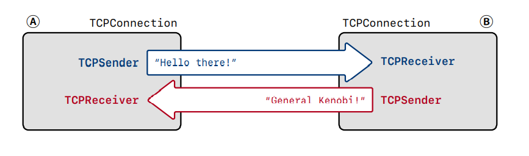

# Lab4: TCP Connection


在这个Lab，我们会将之前的三个Lab整合起来，让它们成为一个新的模块`TCP Connection`。

## Overview

TCP协议是一个`面向连接`的协议，它底层会维护一对`可靠`的`字节流`，连接有两端，连接的每一端被称为端点或者对等体。



TCP Connection的基本工作如下：

1. **接收报文段**：我们知道我们在TCP Receiver中也实现了接受报文段，为什么这里还要实现这个功能？因为我们在TCP Receiver中处理了TCP Receiver自己感兴趣的字段，例如`seqno`, `SYN`, `payload`, `FIN`，除此之外，我们在TCP Sender中还见到了需要处理TCP Receiver编写的通告字段`ackno`，`window size`，这是由TCP Receiver告诉TCP Sender的，以及TCP Segment中还有一些字段是需要TCP Connection来负责处理的，比如`RST`。

* 如果接收到重置(`RST`)报文段，中止TCP Sender和TCP Receiver中的字节流，关闭整个连接。否则...
* 把Segment丢给TCP Receiver处理它感兴趣的字段：`seqno`, `SYN`, `payload`, `FIN`。
* 把`ackno`和`window size`丢给TCP Sender进行处理。
* 收到了报文段确保至少回复一个报文段来通告`ackno`和`window size`

2. **发送报文段**：TCP Sender已经处理了大部分逻辑，但是我们在TCP Sender发送报文段的时候并没有设置报文段中的`ackno`和`window size`，因为这是由同一方的TCP Receiver告诉TCP Sender的，需要TCP Connection这一层抽象把它们联系起来。
3. **超时重传**：TCP Sender中也处理了大部分逻辑，但是我们仍需要处理一些额外的情况，例如超时重传次数超过了最大限制，我们应该中止连接，发送一个重置报文段到对等体。

## Implementation

TCP是一个面向连接的协议，它的状态机描述了连接的整个生命周期，从三次握手开始建立连接，然后传输数据，再到四次挥手关闭连接。所以从三次握手建立连接开始实现是再合适不过了。

### void connect()

这里需要提一下，只有三次握手第一次发送SYN报文段是不需要`ackno`和`window size`的，所以当只有接收到了`SYN`之后，都会需要设置报文段中的`ackno`和`window size`，并且如果必要的话，需要关闭连接，因为有可能此时字节流都已经关闭了，如果我们不去判断是否关闭连接可能会造成长时间闲置状态，会造成浪费资源维护无用连接的情况。

另外一点是，窗口字段是有限制的，它是一个无符号16位整数，所以需要做一点判断。

```c++
//! \brief Initiate a connection by sending a SYN segment
void TCPConnection::connect() {
    _sender.fill_window();
    fill_segments_out();
}
// 负责把sender发送的segment移动到connection中的segments_out中，期间还可以设置ackno和window size
void TCPConnection::fill_segments_out() {
    while (!_sender.segments_out().empty()) {
        TCPSegment seg = _sender.segments_out().front();
        _sender.segments_out().pop();
        // set the ack and ackno
        if (_receiver.ackno().has_value()) {
            seg.header().ack = true;
            seg.header().ackno = _receiver.ackno().value();
        }
        // notify the winsize
        if (_receiver.window_size() < numeric_limits<uint16_t>::max()) {
            seg.header().win = _receiver.window_size();
        } else
            seg.header().win = numeric_limits<uint16_t>::max();
        _segments_out.push(std::move(seg));
    }
    clean_shutdown();
}
```

### void write()

我们可能有这么一个需求，应用程序向socket写入了某个字符串，socket就得向连接写入这个字符串，然后尽可能快封装成报文段发送出去，`write`这个接口就负责这件事。

```c++
size_t TCPConnection::write(const string &data) {
    if (data.empty())
        return 0;
    size_t ret = _sender.stream_in().write(data);
    _sender.fill_window();
    fill_segments_out();
    return ret;
}
```

### void segment_received(const TCPSegment &seg)

接受报文段，我是从连接的生命周期来考虑，如果连接逻辑上已经关闭了，那么无论收到任何报文段都会无效。

1. 收到重置报文段，暗示着需要关闭连接。
2. 在整个生命周期，只要收到确认报文段，除了`LISTEN`状态，即被动连接方收到`SYN`之前，我们都需要告诉sender报文段的`ackno`和`window size`。如果TCP Receiver实现得非常好，鲁棒性非常高，这一步会抛弃那些无效的Segment。
3. 在三次握手阶段，即连接还没有完全建立，主要需要考虑三次握手的状态。
   * 第一次握手(只收到SYN报文段): 这时候需要发送SYN/ACK报文段。
   * 第二次握手(收到SYN/ACK报文段): 这时候需要发送一个ACK报文段。
   * 第三次握手(只收到ACK报文段，序列空间长度为0)：这时候不需要回复任何报文段。
4. 在连接建立之后，如果接收到的是一个不为空的segment，那至少要恢复一个确认报文段。

```c++
void TCPConnection::segment_received(const TCPSegment &seg) {
    if (!_active) return;
    _ms_since_last_segment_received = 0;
    if (seg.header().rst) {
        _rst = true;
        unclean_shutdown(false);
        return;
    }
    _receiver.segment_received(seg);
    if (seg.header().ack) {
        if (!_receiver.ackno().has_value()) {
            return;
        }
        _sender.ack_received(seg.header().ackno, seg.header().win); 
    }
    // first, set up the connection
    if (!_established) {
        // first handshake, send SYN/ACK segment
        if (!_sender.syn_sent()) {
            connect();
            return;
        }
        // second handshake, receive a SYN/ACK segment, need to send empty ack segment
        if (seg.header().syn) {
            _sender.send_empty_segment();
            fill_segments_out();
            _established = true;
            return;
        }
    }
    // note that (third handshake | empty segment) will do nothing
    if (seg.length_in_sequence_space()) {
        _sender.send_empty_segment();
    }
    fill_segments_out();
}
```

### void tick()

只需要注意一点：超时重传次数大于最大值时得主动关闭连接，即发送一个重置报文段。

```c++
//! \param[in] ms_since_last_tick number of milliseconds since the last call to this method
void TCPConnection::tick(const size_t ms_since_last_tick) {

    _sender.tick(ms_since_last_tick);
    _ms_since_last_segment_received += ms_since_last_tick;
    if (_sender.consecutive_retransmissions() > TCPConfig::MAX_RETX_ATTEMPTS) {
        unclean_shutdown(true);
        return;
    }
    fill_segments_out();
    // TODO: end the connection cleanly if necessary
    clean_shutdown();
}
```


能自己一步一步实现一个简单的TCP协议还是十分高兴的，能近距离感受那些在书本上晦涩的概念，字节流、可靠传输等等，唯一可惜的就是涵盖的内容不算很多，例如对拥塞控制没有很好的覆盖，只是简单的通过窗口大小限制端系统缓冲区溢出，这些都是十分可惜，希望以后有机会能补上吧。最后放一下测试。

```bash
# linux @ DESKTOP-S8JI0F3 in ~/codespace/sponge/build on git:master x [18:12:30] 
$ make check_lab4
[100%] Testing the TCP connection...
Test project /home/linux/codespace/sponge/build
        Start   1: t_wrapping_ints_cmp
  1/162 Test   #1: t_wrapping_ints_cmp ..............   Passed    0.00 sec
        Start   2: t_wrapping_ints_unwrap
  2/162 Test   #2: t_wrapping_ints_unwrap ...........   Passed    0.00 sec
        Start   3: t_wrapping_ints_wrap
  3/162 Test   #3: t_wrapping_ints_wrap .............   Passed    0.00 sec
        Start   4: t_wrapping_ints_roundtrip
  4/162 Test   #4: t_wrapping_ints_roundtrip ........   Passed    0.16 sec
        Start   5: t_recv_connect
  5/162 Test   #5: t_recv_connect ...................   Passed    0.00 sec
	...
        Start 160: t_isnR_128K_8K_L
158/162 Test #160: t_isnR_128K_8K_L .................   Passed    0.26 sec
        Start 161: t_isnR_128K_8K_lL
159/162 Test #161: t_isnR_128K_8K_lL ................   Passed    0.63 sec
        Start 162: t_isnD_128K_8K_l
160/162 Test #162: t_isnD_128K_8K_l .................   Passed    1.02 sec
        Start 163: t_isnD_128K_8K_L
161/162 Test #163: t_isnD_128K_8K_L .................   Passed    0.21 sec
        Start 164: t_isnD_128K_8K_lL
162/162 Test #164: t_isnD_128K_8K_lL ................   Passed    0.47 sec

100% tests passed, 0 tests failed out of 162

Total Test time (real) =  41.08 sec
[100%] Built target check_lab4
```

```bash
# linux @ DESKTOP-S8JI0F3 in ~/codespace/sponge/build on git:master x [19:25:49] 
$ ./apps/tcp_benchmark 
CPU-limited throughput                : 4.63 Gbit/s
CPU-limited throughput with reordering: 3.23 Gbit/s
```


