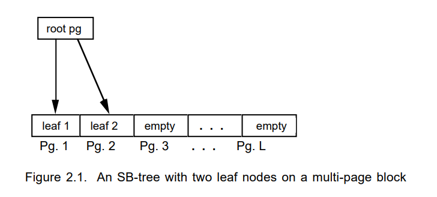

# Notes: The Log-Structured Merge-Tree (LSM-Tree)

## 动机

​		随着写入越来越多，事务型数据库需要在日志记录上建立索引以便宕机时快速恢复。但是B树这样的传统磁盘索引数据结构维护大量的索引数据开销十分昂贵，特别是在I/O方面，特别是`随机I/O`。针对这一问题，作者提出了一种特别的磁盘数据结构：LSM-Tree，日志结构合并树，它使用了**延迟和批量索引修改**的策略，以一种类似于归并排序的方式高效地将索引的修改刷新到磁盘上，相比与传统的访问方法如B树，它减少了磁盘臂的移动，可以有效地降低频繁修改索引文件的开销。

## 双组件LSM Tree模型

​		LSM  Tree通常由两个或者多个数据结构组件构成，先介绍包含两个组件的LSM Tree。如下图所示，LSM Tree一个组件完全驻留在内存中，称为`C0 tree`，而另一个组件驻留在磁盘上，称为`C1 tree`，中间其实还有缓冲池`buffer pool`，使用了某些替换策略如LRU来缓存那些磁盘上频繁被访问的page，即热数据。

​		`C0 tree`并不是一个严格的树形结构，它可以是2-3树、AVL树或者其他数据结构。但是`C1 tree`是一个B树类型的数据结构，作者在论文中提到，它们对`C1 tree`做了一些磁盘顺序访问的优化，并且每个节点都是全满的，并且根节点以下，LSM Tree把一系列连续的`single-page node(block)`打包成了连续的**multi-page block**，用于减少磁盘寻道和磁盘臂旋转的时间。

### Multi-page Block

​		Multi-page Block是我在阅读论文过程中遇到的一个不太理解的概念，而且在网络上也很难找得到相关的文章，事实上multi-page block的思想可以归结为：**批量一次性写入磁盘才能获得良好的写入性能，简单地顺序写入是不够的**，这论文也花了相当篇幅来论证这个观点，这里给出一个十分简略的论证，如果磁盘写入都为顺序写入，那么两次顺序写入之间磁盘可能已经旋转了，那么会存在一个旋转的延迟才能成功完成后一次写入。

​		Multi-page block可以追述到作者的另一篇论文，SB-Tree，它是B+树的一种变种， 除了根节点，其它每一层节点会被组成一个multi-page block，一般每个块会包含64页，也就是64个节点，一个简单的SB-Tree如下图，根节点存在指向一个能容纳L页的multi-page block的指针。本文不会对SB-Tree做过多的介绍，想详细了解SB-Tree怎么做插入、删除操作的请阅读原论文。

​		

### 写流程

1. 首先将生成的日志记录追加到磁盘上的预写日志文件(WAL)。
2. 将索引项写入驻留在内存中的`C0 tree`。这些索引项会在某些特定的时刻被迁移到驻留在磁盘上的`C1 tree`，这样在crash recovery时，系统只要恢复那些崩溃之前还没有迁移到磁盘上的索引项就可以了。
3. 当`C0 tree`的大小达到一个阈值时，就会启动一个滚动合并进程，它会从`C0 tree`上删除一整块连续的索引项，在论文中称为segment，然后把它们合并到磁盘上的`C1 tree`。

### 读流程

​		先读`C0 tree`，如果读到了直接返回。如果没读到，读磁盘上的`C1 tree`。

## 多组件LSM Tree模型

​		随着不断索引项不断地插入，Compaction次数不断地增加，此时会造成这样一种情况，`C1 tree`相对`C0 tree`来说非常大，`C0 tree`很小，那么阈值就很小，又或者每个索引项大小很大导致一个page只能容纳极少数的索引项，这样在每次索引项合并时都会将磁盘上`C1 tree`的很多page移入内存然后移出内存，相当于做了很多次磁盘I/O，这样会导致LSM Tree性能极低，在双组件LSM Tree模型中，可以增大`C0 tree`的大小来改善这个问题，但是由于内存是稀有资源，花费额外的内存来维护一个很大的`C0 tree`是在不是一个很好的选择。

​		一种可行的选择是使用多组件LSM Tree模型，通过拓展原来的双组件LSM Tree模型，添加一系列驻留在磁盘上的中间组件，这样既限制了磁盘IO的开销，也免去了利用过多内存来维护`C0 tree`。

​		

​		多组件的写流程和读流程大致，不再赘述。

## 小结

​		本文没有提及Compaction详细过程的原因是原论文中的Compaction是十分High Level的，而一些后续论文针对工业界LSM-Tree的实现的Compaction更为具体，也更容易理解。

​		阅读这篇论文应该理解这篇论文的动机(背景)。1. 内存大小不断增长。内存越来越大，也可以缓存越来越多的数据，所有的读取都会在缓存中执行，而磁盘的写入也会越来越多，限制系统性能的主要因素是写入性能。2. 顺序I/O性能与随机I/O性能存在着很大的差距。如何最大化顺序I/O减少随机I/O成了提升系统性能的关键。

